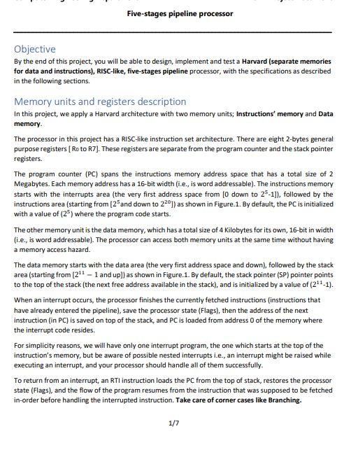
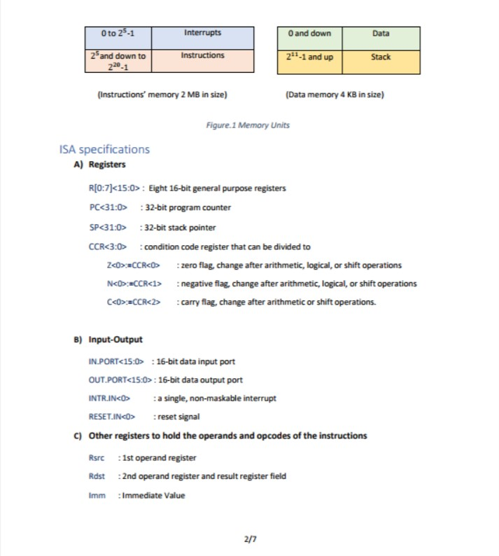
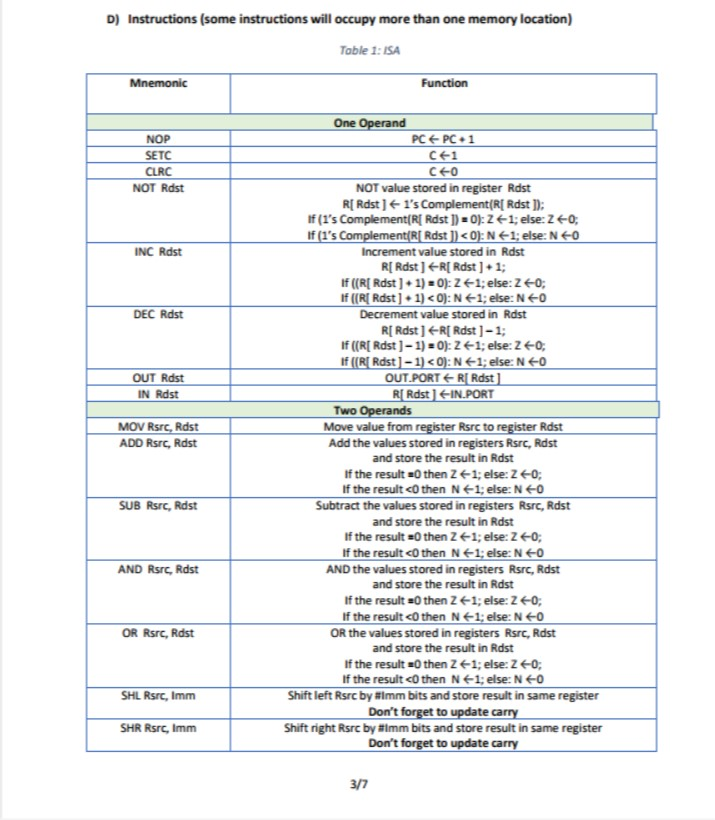
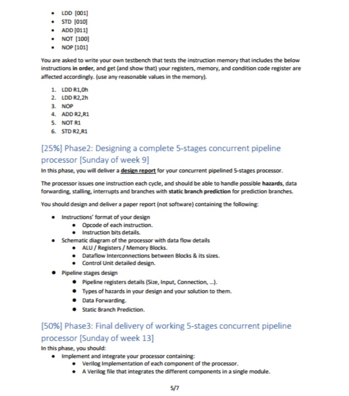
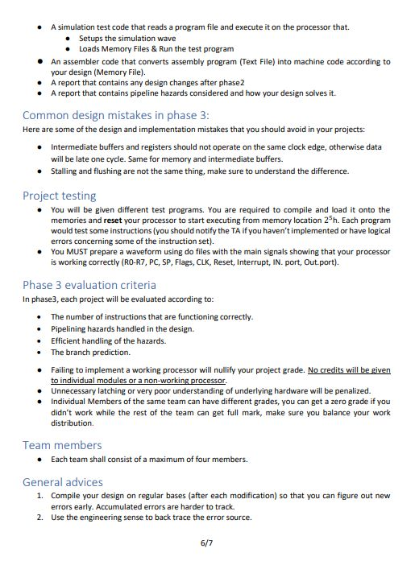
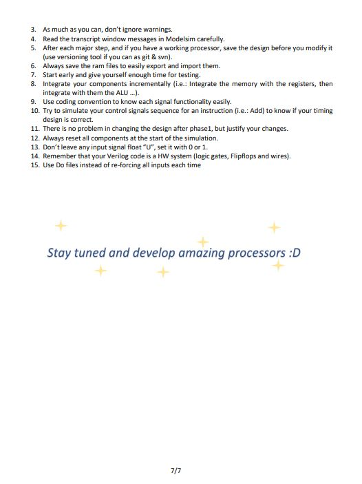
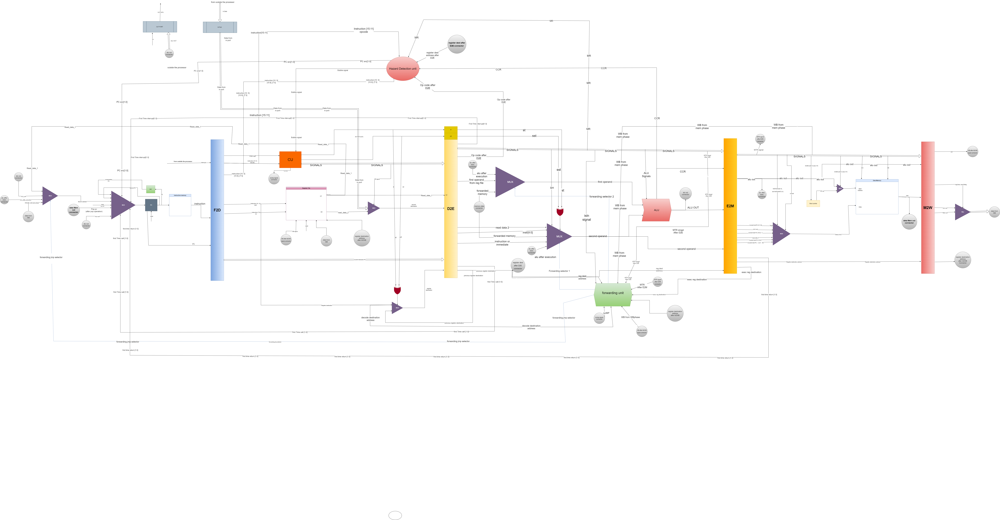

# MZNM-Processor

<h2 href="#Description">Description</h2>
<blockquote>
  

  This is a RISC-like implementation for a 5-stages pipelined processor implemented with Verilog which follows Harvard architecture with 2 separated memories one for the data and the other for the instructions with full forwarding to solve data hazards and a hazard detection unit to solve control hazards.
 

</blockquote>
<h2 href="#Structure">Project Structure</h2>
 
 
  <pre>
MZNM-Processor
├── design
    ├── finalDesign.drawio
    ├── processorDesign.jpg
├── requirements
    ├── 1.jpg
    ├── 2.jpg
    ├── 3.jpg
    ├── 4.jpg
    ├── 5.jpg
    ├── 6.jpg
    ├── 7.jpg
├── ALU.v
├── controller.v
├── controllerTB.v
├── controlUnit.v
├── dataMemory.txt
├── dataMemory.v
├── DEBuffer.v
├── defines.v
├── EMBuffer.v
├── FDBuffer.v
├── forwarding-unit.v
├── hazardDetectionUnit.v
├── inst.py
├── instructionMemory.txt
├── instructionMemory.v
├── instructions.asm
├── pc.v
├── processor.v
├── regfile.v
├── simulation.do
├── stackPointer.v
├── writeBack.v
├── README.md
  </pre>

<h2 href="#Requirements">These are the requirements for the processor</h2>
 <ul>
  <li>
    <h3> Page 1 <h3>
    
  </li>
  <li>
    <h3> Page 2 <h3>
    
  </li>
  <li>
    <h3> Page 3 <h3>
    
  </li>
  <li>
    <h3> Page 4 <h3>
    
  </li>
  <li>
    <h3> Page 5 <h3>
    
  </li>
  <li>
    <h3> Page 6 <h3>
    
  </li>
  <li>
    <h3> Page 7 <h3>
    
  </li>
 </ul>

<h2 href="#Design">Processor Design</h2>
<blockquote>
 Here is our design in an image 
</blockquote>

<h3></h3>

<blockquote>
 You can also view the design details with drawio website in <code> ./design/processorDesign.drawio</code> 
</blockquote>

<blockquote>
 You can also view the design details in <code> ./design/processorDesign.pdf</code> 
</blockquote>