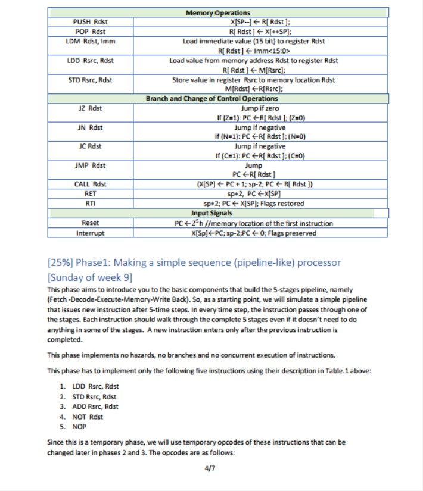

# MZNM-Processor

<h2 href="#Description">Description</h2>
<blockquote>
  

  This is a RISC-like implementation for a 5-stages pipelined processor implemented with Verilog which follows Harvard architecture with 2 separated memories one for the data and the other for the instructions with full forwarding to solve data hazards, a hazard detection unit to solve control hazards, and a compiler script with Python to compile assembly instructions into machine code instructions.
 

</blockquote>

<h2>Build With</h3>
 <ul>
 <li><a href="https://www.tutorialspoint.com/vlsi_design/vlsi_design_verilog_introduction.htm">Verilog</a></li>
  <li><a href="https://eda.sw.siemens.com/en-US/ic/modelsim">ModelSim 2020.1</a></li>
  <li><a href="https://www.python.org/">Python</a></li>
  <li><a href="https://app.diagrams.net/">Drawio</a></li>
 </ul>

   
   
<h2>Getting Started</h3>
<blockquote>
  
This is an list of needed steps to set up your project locally, to get a local copy up and running follow these steps.
 

</blockquote>
<h3 href="#Installation">Installation</h3>
<ol>
  <li><strong><em>Clone the repository</em></strong>
    <blockquote><code>$ git clone https://github.com/MoazHassan2022/MZNM-Processor.git</code></blockquote>
  </li>
  <li> 
  <strong><em>Navigate to repository directory
</em></strong>
    <blockquote><code>$ cd MZNM-Processor</code></blockquote>
  </li>
  <li> 
  <strong><em>Install ModelSim
</em></strong>
  </li>
</ol>
<h3 href="#Running">Running</h3>
<ol>
  <li><strong><em>Run ModelSim</em></strong>
  </li>
    <li><strong><em>Running simulation in ModelSim terminal, this will compile and run assembly instructions written in <code>./instructions.asm</code></em></strong>
    <blockquote><code>$ do simulation.do </code></blockquote>
  </li>
 
</ol>

<h2 href="#Structure">Project Structure</h2>
 
 
  <pre>
MZNM-Processor
├── design
    ├── finalDesign.drawio
    ├── processorDesign.jpg
├── requirements
    ├── 1.jpg
    ├── 2.jpg
    ├── 3.jpg
    ├── 4.jpg
    ├── 5.jpg
    ├── 6.jpg
    ├── 7.jpg
├── ALU.v
├── controller.v
├── controllerTB.v
├── controlUnit.v
├── dataMemory.txt
├── dataMemory.v
├── DEBuffer.v
├── defines.v
├── EMBuffer.v
├── FDBuffer.v
├── forwarding-unit.v
├── hazardDetectionUnit.v
├── inst.py
├── instructionMemory.txt
├── instructionMemory.v
├── instructions.asm
├── pc.v
├── processor.v
├── regfile.v
├── simulation.do
├── stackPointer.v
├── writeBack.v
├── README.md
  </pre>

<h2 href="#Requirements">These are the requirements for the processor</h2>
 <ul>
  <li>
    <h3> Page 1 <h3>
    
  </li>
  <li>
    <h3> Page 2 <h3>
    
  </li>
  <li>
    <h3> Page 3 <h3>
    
  </li>
  <li>
    <h3> Page 4 <h3>
    
  </li>
  <li>
    <h3> Page 5 <h3>
    
  </li>
  <li>
    <h3> Page 6 <h3>
    
  </li>
  <li>
    <h3> Page 7 <h3>
    
  </li>
 </ul>

<h2 href="#Design">Processor Design</h2>
<blockquote>
 Here is our design in an image 
</blockquote>

<h3></h3>

<blockquote>
 You can also view the design details with drawio website in <code> ./design/processorDesign.drawio</code> 
</blockquote>

<blockquote>
 You can also view the design details in <code> ./design/processorDesign.pdf</code> 
</blockquote>