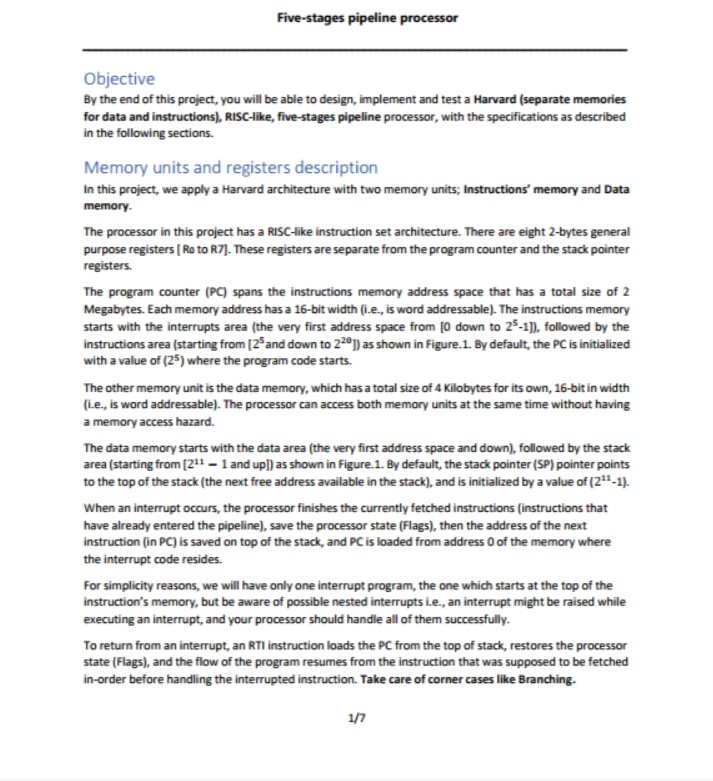
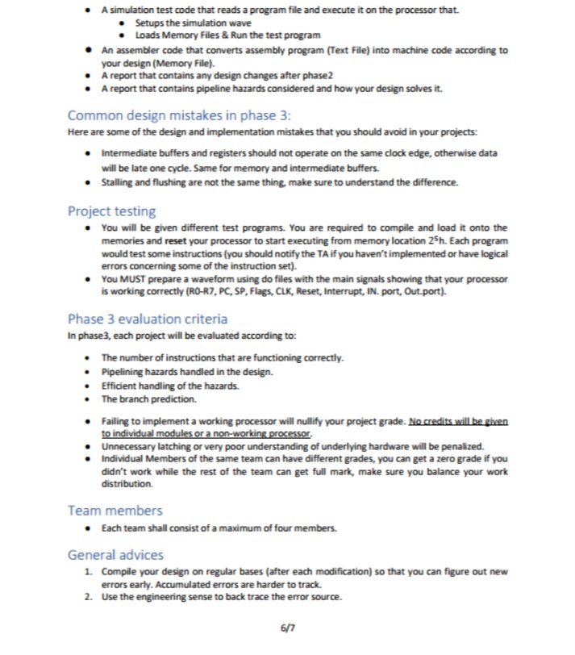
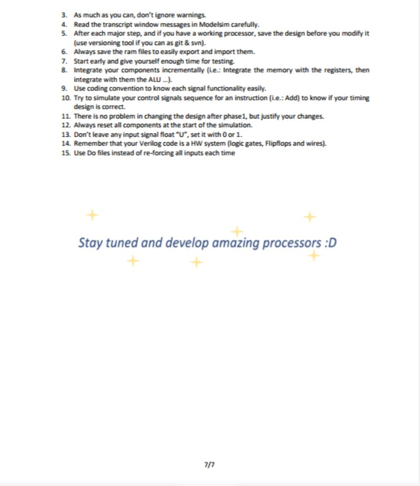

# MZNM-Processor
**This is a RISC-like implementation for a 5-stages pipelined processor implemented with Verilog which follows Harvard architecture with 2 separated memories one for the data and the other for the instructions.**

----------------------------

### These are the requirements for the processor 
 

*   

*   

*   

*   

*   

*   

*   

-----------------------------
## here is our design

